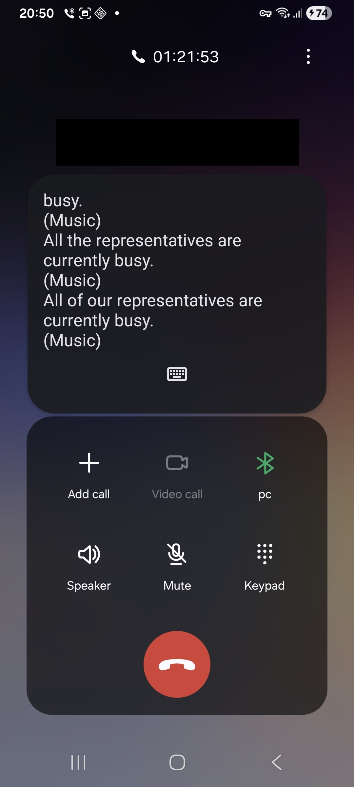

# Hold For Me using ADB
A script that monitors your phone call and alerts you when someone picks up, so you don't have to listen on hold music.
Uses Android's Live Caption feature + Groq (or OpenAI) to detect when a human answers.

## Requirements

- [Live Caption](https://support.google.com/accessibility/android/answer/9350862) enabled on your phone
- USB debugging on your phone
- Groq or OpenAI API key
- `xmllint`, `jq`, `spd-say`, `adb`, `curl` (or using Docker)

## Setup

Copy the sample config and add your API key:

   ```bash
   cp config.sample.sh config.sh
   # Edit config.sh with your API key
   ```

Connect your phone via ADB:

   ```bash
   adb devices  # Verify connection
   ```

Run the script:

   ```bash
   ./run_live.sh
   ```

## Setup using Docker

    docker compose build
    docker compose run --rm -it app adb devices
    docker compose run --rm -it app /app/run_live.sh

# Example output (no answer)

    $ ./run_live.sh 
    [20:48:14] Saved: dump1/20251224_204814_1.xml (md5: 4b3a9d95369e3bc9a0b82295be4b2a76)
    XXX
    All of our representatives are currently busy.
    (Music)
    (Music)
    Representatives are currently busy.
    (Music)
    All of our representatives are currently busy.
    (Music)
    XXX
    HOLD
    [20:48:23] No change (md5: 4b3a9d95369e3bc9a0b82295be4b2a76)    
    [20:48:28] Saved: dump1/20251224_204828_2.xml (md5: ef17731a6e401ffd88c767cf18649f8c)
    XXX
    (Music)
    Representatives are currently busy.
    (Music)
    All of our representatives are currently busy.
    (Music)
    All that representatives are currently busy.
    XXX
    HOLD
    ^C

# Example output (simulated answer)

    $ ./run_live.sh 
    [20:49:46] Saved: dump1/20251224_204946_1.xml (md5: f4374a50e8aee4c26d01f8a5353b8461)
    XXX
    All that representatives are currently busy.
    (Music)
    Of a representatives are currently busy.
    (Music)
    All the representatives are currently busy.
    (Music)
    XXX
    HOLD
    !!! CHECK CALL !!!
    Press 'c' to continue monitoring, Ctrl+C to stop the script
    cContinuing...
    [20:49:58] No change (md5: f4374a50e8aee4c26d01f8a5353b8461)    ^C

# Example output (using Docker)

    $ docker compose run --rm -it app /app/run_live.sh
    [02:00:18] Saved: dump1/20251226_020018_1.xml (md5: 771e176bf22c95ea7e991bb0ef13ff23)
    XXX
    [Call started. Captions will appear here.]
    …
    (Music)
    (Music)
    Representatives are currently busy.
    (Music)
    XXX
    HOLD
    [02:00:29] No change (md5: 771e176bf22c95ea7e991bb0ef13ff23)    ^C


# Example Call With Live Captions


# Troubleshooting
Make sure that you tab on Live Caption, so it's focused, otherwise adb will read other things.

Run the following to see what's captured.

Dialer in focus:

    $ adb exec-out uiautomator dump /dev/tty 2>/dev/null | sed 's|UI hierchary dumped to: /dev/tty||' | xmllint --format - | grep -oP '(?<=text=")[^"]*'
    03:45
    <redacted>
    Add call
    Video call
    Bluetooth
    Speaker
    Mute
    Keypad

Live Caption in focus:

    $ adb exec-out uiautomator dump /dev/tty 2>/dev/null | sed 's|UI hierchary dumped to: /dev/tty||' | xmllint --format - | grep -oP '(?<=text=")[^"]*'
    (Music)
    Representatives are currently busy.
    (Music)
    All of our representatives are currently busy.
    (Music)
    All of our representatives are currently busy.
    (Music)
